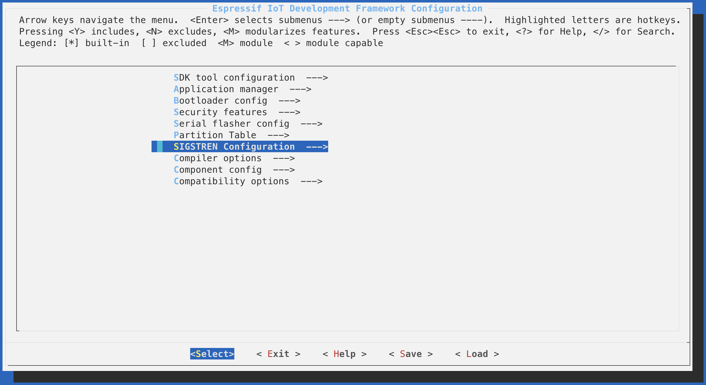

Sigstren
======

:signal_strength::muscle: ESP32 project to detect the signal strength of specified wi-fi AP and display the values via a RGB led :vertical_traffic_light:

Project developed as means of learning about ESP32, ESP-IDF building, ESP-IDF WiFi, ESP-IDF I2C, BlinkM RGB Led.

The circuit was layout like the image below.
<< add circuit schemactic here >>

References
----------

- [ESP-IDF Wi-Fi Driver](https://docs.espressif.com/projects/esp-idf/en/latest/api-guides/wifi.html?highlight=esp_wifi_scan_start#wi-fi-driver)
- [ESP-IDF Event Loop Library](https://docs.espressif.com/projects/esp-idf/en/latest/api-reference/system/esp_event.html#event-loop-library)
- [ESP-IDF I2C Library](https://docs.espressif.com/projects/esp-idf/en/latest/api-reference/peripherals/i2c.html#i2c)
- [ThingM BlinkM Datasheet](https://static1.squarespace.com/static/5c155684f407b4100552994c/t/5c2d20ca0e2e7292108eadf8/1546461407535/BlinkM_datasheet.pdf)
- [Lucadentella.it - ESP32 I2C Basic](http://www.lucadentella.it/en/2017/10/09/esp32-23-i2c-basic/)
- [Github ESP-IDF WiFi Scan Example](https://github.com/espressif/esp-idf/tree/master/examples/wifi/scan)

  

Build
-----

Clone the repo and "cd" into it.

To be able to run the idf.py toolchain follow [Espressif Get Started](https://docs.espressif.com/projects/esp-idf/en/latest/get-started/index.html).

```
$ idf.py build
```

To flash the builded flash image
```
$ idf.py -p /dev/cu.SLAB_USBtoUART flash
```

To have ESP32 listed in MacOS /dev/* download [driver](https://www.silabs.com/products/development-tools/software/usb-to-uart-bridge-vcp-drivers) and install it.

After flashing your ESP32 you can monitor the logs using:
```
$ idf.py -p /dev/cu.SLAB_USBtoUART monitor
```

To quit the idf.py monitor tool use **COMMAND/CTRL + ]**
 
Usage
-----

By default Sigstren will look for an WiFi router named "myssid". To change that you need to run:
```
$ idf.py menuconfig
```


Sigstren will look for the configured WiFi SSID and based on its recurrent scans will change the RGB Led color. For a weak signal the led will be red, we also have yellow(ish) for medium signal and green for a good signal. If the led blue it means Sigstren couldn't find the configured WiFi SSID.


Changelog
---------

